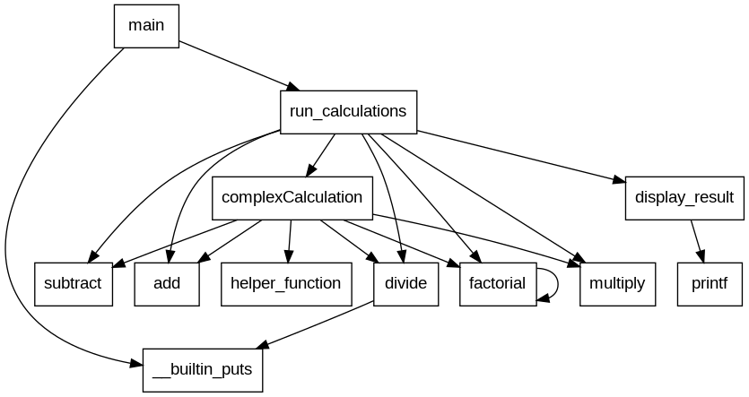
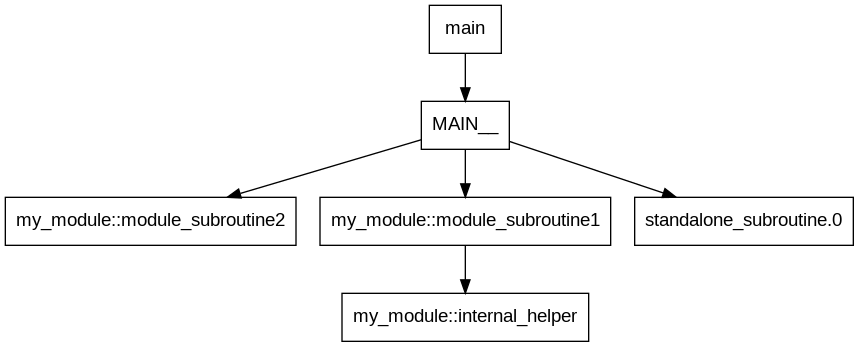

# cgraph2dot

A Python utility that converts GCC's callgraph dump files (.cgraph) to DOT format for visualization.

`cgraph2dot` processes `.cgraph` files produced by GCC's `-fdump-ipa-cgraph` option, extracts callgraph information, consolidates it, applies optional filtering and rewriting rules, and generates a DOT file that can be visualized using Graphviz or other graph visualization tools.


*C example call graph*


*Fortran example call graph with module name rewriting*

This tool helps developers analyze and understand the call relationships between functions in their codebase, making it easier to:

- Visualize complex code structures
- Identify dependencies between modules
- Optimize code by understanding call patterns
- Document code architecture
- Simplify complex graphs by filtering or rewriting symbol names

CMake integrations are available to build call graphs of CMake targets.


## Prerequisites

- Python 3.6 or higher
- Graphviz (optional, for visualization)


## Setup

Clone this repository:

```
git clone https://github.com/dmikushin/cgraph2dot.git
```


## Usage

### Command Line

```bash
./cgraph2dot [--filters /path/to/filters.json] output.dot input1.cgraph input2.cgraph ...
```

Parameters:

- `output.dot` - The name of the DOT file to be generated
- `input1.cgraph`, `input2.cgraph`, ... - One or more `.cgraph` files from GCC
- `--filters /path/to/filters.json` (optional) - Path to a JSON file specifying filter and rewrite rules for symbols.

The JSON filter file can contain the following keys:
- `removal-filters`: A list of regex patterns. Symbols matching any of these patterns will be removed.
- `keep-filters`: A list of regex patterns. If provided, only symbols matching these patterns will be kept.
- `rewrite-filters`: A list of objects, each with a `pattern` (regex) and a `replacement` string. Symbol names matching the pattern will be rewritten.

Example `filters.json`:
```json
{
  "rewrite-filters": [
    {
      "pattern": "^__mymodule_MOD_",
      "replacement": "mymodule::"
    }
  ],
  "removal-filters": [
    "^__builtin_",
    "^std::"
  ],
  "keep-filters": [
    "^mymodule::",
    "^main$"
  ]
}
```

### CMake Integration

For seamless integration with CMake projects, use the provided `CGraphVisualizer.cmake` module:

1. Place `CGraphVisualizer.cmake` and `FindCGraphs.cmake` in your project's `cmake` directory.
2. Place the `cgraph2dot` script in a location accessible by your CMake script (e.g., project's `cmake` directory or a directory in `PATH`).
3. Add the following to your `CMakeLists.txt`:

```cmake
# Add the directory containing CGraphVisualizer.cmake to the module path
list(APPEND CMAKE_MODULE_PATH "${CMAKE_SOURCE_DIR}/cmake")

# Include the CGraphVisualizer module
include(CGraphVisualizer)

# Enable callgraph visualization for a target
add_callgraph_visualization(
    TARGET my_target
    # Optional: Specify a filter file
    # FILTER_FILE "${CMAKE_CURRENT_SOURCE_DIR}/filters.json"
)

# Optional: Generate a PNG image of the callgraph
add_callgraph_image(my_target png)
```

This will:
- Automatically add the `-fdump-ipa-cgraph` compiler option to your target.
- Run the `cgraph2dot` tool after building to generate a `.dot` file, applying filters if specified.
- Optionally create an image file using Graphviz (requires Graphviz to be installed).

### Generating .cgraph files manually

To produce the input files for this tool manually, compile your code with GCC using the `-fdump-ipa-cgraph` option:

```bash
gcc -fdump-ipa-cgraph source.c -o program
```

This will generate a `.cgraph` file for each compiled source file.


## Examples

The `examples` directory contains sample projects demonstrating the usage of `cgraph2dot`.

### C Example (`examples/c_example`)

A simple C project demonstrating basic call graph generation.

1. Compile your code with callgraph dumping enabled:
```bash
# (Assuming you are in the examples/c_example directory)
# Or use the provided CMakeLists.txt
gcc -fdump-ipa-cgraph *.c -o myprogram
```

2. Process the generated `.cgraph` files:
```bash
# (Assuming cgraph2dot is in your PATH or accessible)
python /path/to/cgraph2dot callgraph.dot *.cgraph
```

3. Visualize the resulting DOT file:
```bash
dot -Tpng callgraph.dot -o callgraph.png
```

### Fortran Example (`examples/fortran_example`)

A Fortran project demonstrating the use of filters to rewrite mangled module function names.
It uses a `filters.json` file to transform names like `__my_module_MOD_my_procedure` to `my_module::my_procedure`.

Refer to the `CMakeLists.txt` and `filters.json` within the `examples/fortran_example` directory for details on how it's configured.

### CMake Example

```cmake
cmake_minimum_required(VERSION 3.10)
project(MyProject)

# Add the directory containing CGraphVisualizer.cmake to the module path
list(APPEND CMAKE_MODULE_PATH "${CMAKE_SOURCE_DIR}/cmake")

# Include the CGraphVisualizer module
include(CGraphVisualizer)

# Create an executable target
add_executable(my_app main.c util.c)

# Enable callgraph visualization for the target
add_callgraph_visualization(my_app)

# Optional: Generate a PNG image of the callgraph
add_callgraph_image(my_app png)
```

After building the `my_app` target, a `my_app.dot` file will be automatically generated in the build directory. If you enabled image generation, a `my_app.png` will also be created.


## Features

### Command Line Tool
- Processes multiple `.cgraph` files at once
- Extracts function names and their calling relationships
- Consolidates information from different compilation units
- Supports symbol filtering and rewriting via a JSON configuration file
- Generates DOT format graph for visualization

### CMake Integration
- Seamless integration with CMake build systems
- Automatically adds required compiler flags
- Supports passing a filter configuration file for symbol manipulation
- Generates callgraphs as part of the normal build process
- Supports both single and multi-configuration generators
- Optional automatic image generation with Graphviz
- Works with any target (executables, static libraries, shared libraries)


## Visualization Options

### PNG Image

```bash
dot -Tpng callgraph.dot -o callgraph.png
```

### SVG (Scalable Vector Graphics)

```bash
dot -Tsvg callgraph.dot -o callgraph.svg
```

### PDF Document

```bash
dot -Tpdf callgraph.dot -o callgraph.pdf
```

### Interactive Graph with xdot

```bash
xdot callgraph.dot
```


## Limitations

- The tool relies on GCC's dump format, which may change between compiler versions.
- Very large codebases may produce complex graphs that are difficult to visualize effectively.
- The tool analyzes static call relationships and cannot capture dynamic function calls through function pointers or virtual methods.


## Files

The project consists of the following files:

- `cgraph2dot` - The main Python script that processes `.cgraph` files
- `CGraphVisualizer.cmake` - CMake module for integration with CMake build systems

### cgraph2dot

This is the core Python script that does the actual work of parsing `.cgraph` files and generating the DOT output.

### CGraphVisualizer.cmake

This CMake module provides:

- `add_callgraph_visualization(TARGET [FILTER_FILE <path>])` - Main function to enable callgraph generation for a target. Optionally takes a `FILTER_FILE` argument for JSON-based symbol filtering.
- `add_callgraph_image(TARGET FORMAT)` - Optional function to also generate an image in the specified format.

